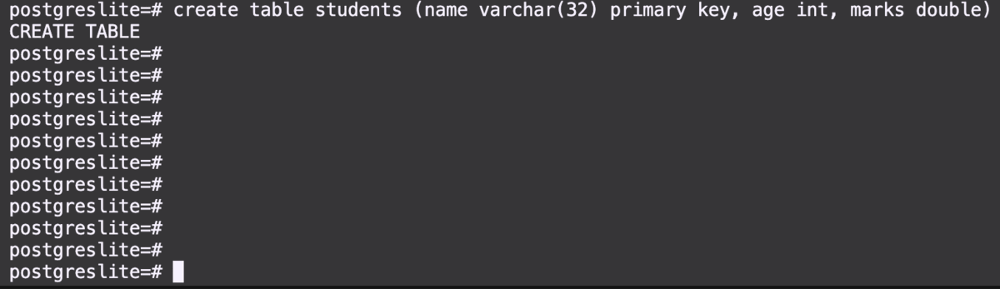

# SimpleSQLEngine

A project implementing a lightweight SQLite engine from scratch with support for `CREATE`,`INSERT`, and `SELECT` queries, including mathematical operations on columns.



## Project Architecture

The project comprises of different components as shown below fig:-


1. **Parser**: 
The parser component is responsible for analyzing and validating user-provided SQL queries. It ensures that the input queries are syntactically correct and adherent to the SQL language rules. In case of any errors or illegal input, the parser generates error messages for the user. Once validated, the parser invokes the appropriate methods in the RDBMS component to execute the specified operations.

2. **B+ Tree:** 
The B+ Tree library is a standardized component offering a set of functions for performing CRUD (Create, Read, Update, Delete) operations in the context of SQL queries. It serves as a robust library for managing B+ tree data structures, providing efficient mechanisms for insertion, retrieval, updating, and deletion operations.

3. **RDBMS Engine:** 
The RDBMS engine is the project's core, orchestrating backend operations by processing parsed tokens from the parser. It interacts with various components to manage user input, creating tables using the B+ Tree library, storing records, and providing outputs for select queries. The supported operations are `SELECT`, `DROP`, `INSERT` and `CREATE`.

4. **SQL Interface:**
The SQL interface comprises a set of APIs bridging the interaction between the core RDBMS, and the Mathematical Expression library. Serving as a wrapper, it facilitates seamless communication by encapsulating the internal APIs of the mathematical expression library.

5. **libMexpr.a:** 
libMexpr.a is a math expression parser package that processes mathematical expressions, generating parse trees from input expressions typically found in select queries applied to columns. This file is compiled from this [package](https://github.com/sachinites/MathExpressionParser).


The project is based on a Udemy course; for in-depth understanding, refer to this [course](https://www.udemy.com/course/rdbmsdev/).

## Run

- First, clone the repository:
```bash
gh repo clone srsawant34/SimpleSQLEngine
```

- Compile the project:
```bash
cd SqlParser
sh compile.sh
```

- Running the project:
```bash
./dbms.exe
```

### MacOS

For macOS, I would recommend to use docker

- make dockerfile:
```dockerfile
# Use an official Ubuntu base image
FROM ubuntu:latest

# Install necessary packages
RUN apt-get update && \
    apt-get install -y \
    git \
    g++ \
    flex \
    sudo

# Set up a non-root user with sudo privileges
RUN useradd -ms /bin/bash user && \
    usermod -aG sudo user && \
    echo 'user ALL=(ALL) NOPASSWD:ALL' >> /etc/sudoers

# Set the working directory to the user's home directory
WORKDIR /home/user

# Switch to the non-root user
USER user
```

- building the docker image:

```bash
docker build . -t ubuntu
```

- running the container in interactive mode

```bash
docker run -it ubuntu
```

And repeat the above steps to run the project. 
